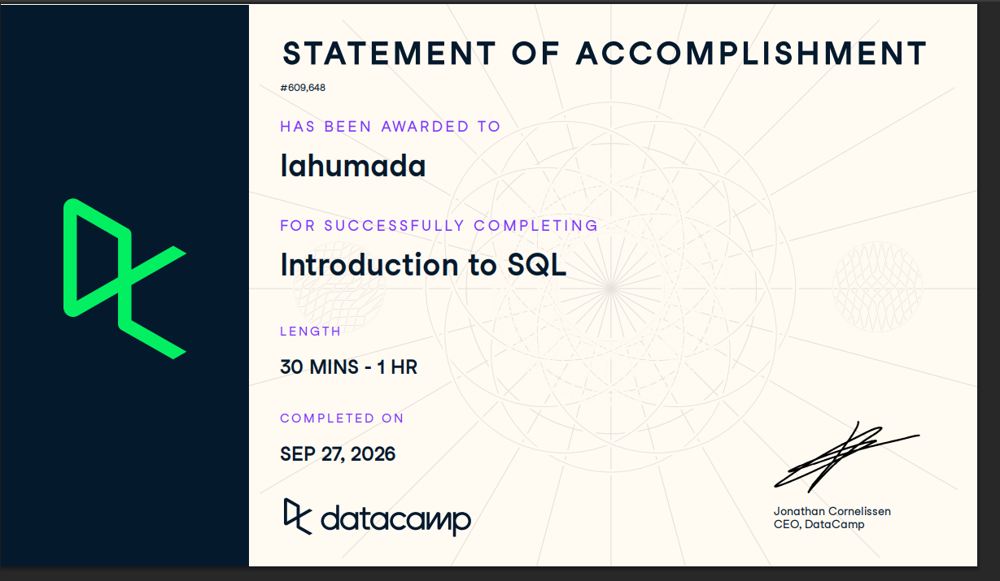

# Course-Completion Evidence

I completed the DataCamp course **Introduction to SQL** on September 27, 2026, through the IBM 6500 DataCamp classroom.

# Learning Notes and Key Takeaways

## Meet Databases

### Main Ideas:

A database is a system used to store, organize, retrieve, and manage data. Relational databases organize into tables. each table focuses on one type of info or event

Rows represent individual records, observation, or events.

Columns represent attributes or properties.

Understanding these 3 is important because SQL queries depend on knowing which table has the info that I am looking for and which columns contain the values I want to analyze.

### Important SQL Syntax

`SELECT` tells SQL what data to retrieve

`FROM` tells SQL which table to retrieve the data from

`* means all columns in selected table`

### Example

> Example:
>
> SELECT \*
>
> FROM campaigns;

this retrieves all columns from the `campaigns` table. The asterisks mean `all columns`.

We can organize data in our CEP, specifically engagement, clicks, reservations, etc.

## Write Your First SQL Queries

### Main Ideas

This section introduced basic structure SQL query and showed how to retrieve specific info.

`SELECT` is used to choose columns to return, while `FROM` identifies the table that includes the data

`SELECT*` returns every column

Lesson also introduced sorting with `ORDER BY`, using `ASC`, and `DESC`, and using `LIMIT` to limit number of returned rows

Being precise with the syntax is also important

### Important SQL Syntax

`SELECT` — chooses the columns to return.

`FROM` — identifies the table.

`ORDER BY` — sorts the result by a selected column.

`ASC` — sorts from lowest to highest.

`DESC` — sorts from highest to lowest.

`LIMIT` — restricts the number of rows returned.

### Example

> SELECT conversion_id,
>
> revenue,
>
> status
>
> FROM conversions
>
> ORDER BY revenue
>
> DESC LIMIT 5;

This selects the conversion ID, revenue, and `conversions` table

`ORDER BY revenue DESC` sorts conversions from highest to lowest

This can help me during the CEP because I can sort campaigns by impressions and identify the campaigns with the highest reach.

## Find Unique Values and Rename Columns 

### Main Ideas

This section introduced `DISTINCT` which is used to duplicate values from query results.

`AS` was also introduced which gives a column a clearer name in the query without having to change the original column in the dataset.

### Important Syntax

`DISTINCT` - returns only unique values

`AS` - gives a column a temporary alias in the query result

### Example

> SELECT DISTINCT country AS lead_countries
>
> FROM leads;

`Country` column is looked at in the `leads` table and returns each country once

`Distinct` removes duplicate country values, while `AS lead_countries`\`changes the column heading to the alias

This could help me in the CEP by allowing me to identify different categoires that exist in a dataset.

## Overall Reflection

I think everything I learned were the most useful skills. This is my first time actually sitting down and learning the basics of using the SQL commands. At work we have manual excel sheets, and after going through the training, I feel liek running SQL would make finding and sorting data so much easier.

The most challenging concept was making sure that the syntax was precise. It is very easy to make a mistake, so I had to make sure that I was typing in the correct one or else I would get an error. Also, understanding the correct order of the SQL is going to take some more practice.

SQL can support digital marketing by making data retrieval and organization much better. For example, for survey research, questions and answers could be easily organized under specific categories. It also allows us to build large databases without the fear of losing information or fear of not being able to organize the data.

I expect to review the order of the commands and syntax more than anything. I feel like I have the basic commands down , it just takes some time to truly get it down.

# Appendix

[Github Repo](https://github.com/lahumada63/ibm-6500-sql-learning-portfolio.git)

[Git Page](https://lahumada63.github.io/ibm-6500-sql-learning-portfolio/#course-completion-evidence)
